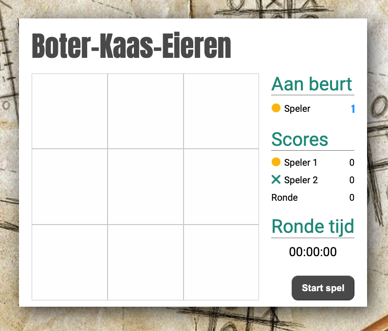

# MODULE 05 - Mijn Eerste Webgame
  
|   	|   	|
|---	|---	|
| _Versie_  	| November 2022  	|
| _Auteur_  	| J.J. Strootman  	|  
  
# Wat gaan we doen?
## Inleiding
In deze module gaan we HTML5, CSS3 en JavaScript gebruiken om een eerste complete applicatie te bouwen. We passen dus nu onze kennis en vaardigheden toe van HTML5, CSS3 en JavaScript. Wat er echter extra bijkomt is het leren samenbrengen van deze drie in één geheel (applicatie dus). Dit vergt 'anders denken' van je.  
Je kunt het vergelijken met de tijd toen je nog klein was en Nederlandse woordjes leerde en pas later dat je daar dan een verhaal van moest kunnen maken. De woordjes in deze vergelijking is hetzelfde als de ***'woordjes'*** van b.v. JavaScript leren en nu moet je deze JavaScript ***'woordjes'*** samenvoegen om er een ***'verhaal'*** van de maken.  
  

  
## Hoe pakken we dit aan?  

Tijdens de instructiemomenten werkt de docent samen met jullie (als voorbeeld) aan het spel Boter-Kaar-Eieren. Hiermee leer je o.a. het volgende:  
* Gestructureerd aanpakken van een project  
* Nadenken over hoe een gebruiker acteert (wat doet een gebruiker)
* Toepassen van JavaScript in een groter geheel
* Nieuwe instructies van JavaScript leren kennen
* Online zoeken naar informatie over hoe iets in JavaScript te programmeren
* In JavaScript reageren op gebeurtenissen (b.v. door gebruikers gestart), **Events** genoemd.
* En meer......  

# Wat vind je in deze repo?

## Mappen & bestanden
* **css** *(map)*  
  De stylesheet voor de applicatie. In deze map vinden we het bestand  

  ***style.css***   

* **img** *(map)*  
  Alle afbeeldingen die we in de applicatie gebruiken. Van favicon tot .png files.  

* **js** *(map)*  
  Hierin plaatsen we het bestand:  
    
  ***index.js***  
    
  In dit bestand plaatsen we alle JavaScript code om het spel werkend te krijgen.
  
* **index.html** *(bestand)*  
  Dit is de startpagina, en tevens de enige pagina, van onze applicatie. Hierin hebben we het spel vormgegeven.